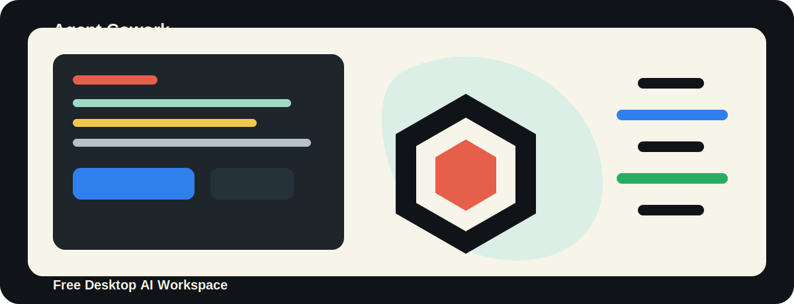

<div align="center">



# Agent Cowork

### 一个可以完全免费使用的桌面 AI 协作工具

**工具本身完全免费，不需要花一分钱。**
你可以把它装在自己的电脑上，用 NVIDIA NIM 的免费模型额度，或者接入你自己的兼容 API，让 AI 帮你读项目、改代码、写文档、跑命令。

[](https://github.com/10000ge10000/agent-cowork/releases)
[](https://github.com/10000ge10000/agent-cowork/releases)
[](#开发和构建)
[](LICENSE)

</div>

> 说明：这里说的“免费”，指 Agent Cowork 这个工具本身免费开源，不收取任何软件费用。模型 API 是否免费，取决于你使用的服务商；如果你使用 NVIDIA NIM 当前可用的免费额度，就可以做到不花钱跑起来。

## 这是什么？

Agent Cowork 是一个跨平台桌面 AI 协作客户端，基于原项目 [`DevAgentForge/Claude-Cowork`](https://github.com/DevAgentForge/Claude-Cowork) 二次开发。

你可以把它理解成一个“桌面版 AI 工作台”：选择一个项目文件夹，输入你要做的事，AI 就可以在这个目录里阅读代码、修改文件、运行命令、解释报错、整理文档。所有会话历史都保存在本地，界面也会显示 AI 正在做什么。

它不是只能连接官方 Claude。这个版本新增了 NVIDIA NIM 和自定义 API 配置，可以把 Claude Agent SDK 的请求转成 OpenAI 兼容接口，让更多免费或自建模型也能参与工作。

## 你可以拿它干什么？

- 让 AI 阅读一个陌生项目，并告诉你目录结构和核心逻辑。
- 让 AI 修 Bug，比如把报错日志贴进去，让它定位代码并修改。
- 让 AI 重写 README、生成部署文档、整理教程素材。
- 让 AI 检查上线前风险，比如权限、安全、构建脚本、测试覆盖。
- 让 AI 批量修改代码，比如统一配置项、拆分组件、补充类型。
- 让 AI 帮你运行 `lint`、`typecheck`、`test`、`build`，并根据结果继续修。
- 让 AI 在 Windows、macOS、Linux 上使用同一个桌面工作流。

## 核心能力

| 能力 | 说明 |
| --- | --- |
| 桌面会话管理 | 每个任务都可以选择独立工作目录，避免 AI 跑错项目。 |
| Claude Agent SDK | 使用 Claude Agent SDK 执行文件编辑、命令运行、项目分析等任务。 |
| 本地历史记录 | 使用 SQLite 保存会话、消息、最近目录和权限请求。 |
| 流式输出 | AI 回复会实时显示，不用等完整结果结束。 |
| Markdown 和代码高亮 | 回复里的 Markdown、代码块、工具调用结果都更好读。 |
| NVIDIA NIM 支持 | 内置 Anthropic-to-OpenAI 本地代理，把请求转到 `/chat/completions`。 |
| 自定义 API | 可填写自己的 Anthropic 兼容服务地址和模型名。 |
| 权限策略 | `Bash`、`Write`、`Edit` 等危险工具默认需要确认，避免误操作。 |
| 跨平台打包 | 支持 Windows portable、macOS dmg、Linux AppImage。 |

## 和原项目有什么不同？

这个项目不是简单改名，而是在原项目基础上补了一批更适合实际使用和发布的能力：

| 方向 | 原项目 | Agent Cowork |
| --- | --- | --- |
| 模型配置 | 主要依赖本机 Claude 配置 | 增加应用内 API 设置、连接测试、NVIDIA 和自定义 API |
| 免费模型接入 | 没有内置协议转换 | 内置本地代理，可把 Anthropic 请求转成 OpenAI 兼容请求 |
| 会话存储 | 基础会话能力 | SQLite 持久化保存会话、消息、最近目录和权限请求 |
| 权限控制 | 更多依赖 SDK 默认行为 | 主进程统一决策，危险工具默认确认 |
| IPC 安全 | 主要依赖 TypeScript 类型 | 增加运行时校验，未知事件不会进入业务处理 |
| 设置页 | 配置能力较少 | 增加 API、模型、权限策略等设置 |
| 测试与 CI | 覆盖较少 | 当前 68 个测试用例通过，并接入 GitHub Actions |
| Windows 分发 | 不是重点 | 增加 Windows x64 portable 打包 |

## 快速开始

### 方式一：下载成品包

到 Releases 下载对应系统的安装包：

```text
https://github.com/10000ge10000/agent-cowork/releases
```

Windows 用户优先下载 `.exe` portable 版本，双击即可使用。

### 方式二：从源码运行

前置条件：

- Bun
- Node.js 22+
- 一个可用的模型 API Key，比如 NVIDIA NIM API Key，或者你自己的 Anthropic 兼容 API Key

```bash
git clone https://github.com/10000ge10000/agent-cowork.git
cd agent-cowork

bun install
bun run dev
```

启动后打开设置页，填入 API Key、接口地址和模型名。

## 模型应该怎么填？

### 推荐：NVIDIA NIM 免费额度

如果你想尽量不花钱，优先试 NVIDIA NIM。设置页可以这样填：

| 配置项 | 示例 |
| --- | --- |
| API 类型 | `NVIDIA` |
| Base URL | `https://integrate.api.nvidia.com/v1` |
| API Key | 填你的 NVIDIA NIM Key |
| 模型 | `minimaxai/minimax-m2.7` |

也可以试这些模型名：

```text
minimaxai/minimax-m2.7
qwen/qwen3-next-80b-a3b-instruct
qwen/qwen3.5-122b-a10b
deepseek-ai/deepseek-v4-flash
```

NVIDIA 模式下，Agent Cowork 会在本机启动一个只监听 `127.0.0.1` 的代理，把 Claude Agent SDK 的 `/v1/messages` 请求转换成 OpenAI 风格的 `/chat/completions` 请求。

### 自定义 Anthropic 兼容接口

如果你有自己的中转站、自建服务或私有模型网关，可以这样填：

| 配置项 | 示例 |
| --- | --- |
| API 类型 | `自定义` |
| Base URL | `https://your-api.example.com/v1` |
| API Key | 填你的服务商 Key |
| 模型 | `claude-sonnet-4-5-20250929` 或服务商提供的模型 ID |

注意：自定义 API 必须兼容 Anthropic `/v1/messages` 协议。
如果你的服务只有 OpenAI `/chat/completions`，请使用 NVIDIA 模式对应的转换逻辑，或者自己提供一层 Anthropic 兼容接口。

## 本地文件和安全说明

- 会话、消息和最近目录保存在本地 SQLite 数据库中。
- API Key 当前保存在本地配置文件中，项目暂未接入系统 Keychain、Windows Credential Manager 或 Electron `safeStorage`。
- NVIDIA 本地代理只监听 `127.0.0.1`，默认端口为 `18765`，不会主动暴露到局域网。
- 代理状态接口不会返回 API Key。
- Windows 下运行 Claude Agent SDK 时，临时 `tmpclaude*cwd` 文件会被引导到系统临时目录，避免堆在项目文件夹里。
- `Bash`、`Write`、`Edit` 等高风险工具默认进入确认流程，避免 AI 直接执行危险操作。

## 开发和构建

```bash
# 开发模式
bun run dev

# 类型检查
bun run typecheck

# ESLint 检查
bun run lint

# 单元测试
bun run test

# 前端和类型构建
bun run build

# macOS Apple Silicon
bun run dist:mac-arm64

# macOS Intel
bun run dist:mac-x64

# Windows x64 portable
bun run dist:win

# Linux x64 AppImage
bun run dist:linux
```

当前本地质量检查结果：

```text
Test Files  9 passed
Tests       68 passed
```

GitHub Actions 会在推送到 `main` 后自动构建 Windows、macOS、Linux 版本，并更新 `latest` Release。
如果推送 `v*` 标签，例如 `v0.2.0`，会额外创建对应版本的正式 Release。

## 配置文件在哪里？

标准安装模式下，配置和数据库保存在 Electron `userData` 目录。

Windows portable 模式下，主要文件会放在 exe 同级目录，方便整体迁移：

| 文件 | 作用 |
| --- | --- |
| `api-config.json` | API Key、Base URL、模型名、API 类型 |
| `permission-config.json` | 权限默认模式、工具覆盖策略、危险工具确认开关 |
| `sessions.db` | 会话、消息、最近目录和权限请求 |
| `claude-sdk-config/settings.json` | 应用专用的 Claude SDK 运行配置 |

## 许可证

MIT
